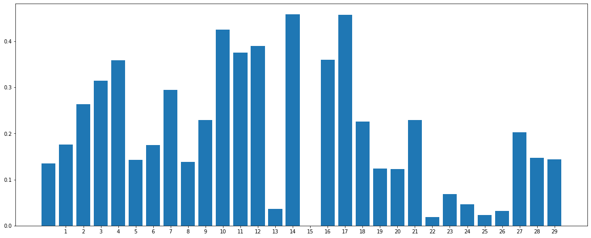

# Fraud_Detection-Optuna-Hyperparamater-Tuning
Fraud Detection System using a LGBM Tuned Classifier.

### Business Problem 
In an era where e-commerce is taking over the world, the Fraud industry is massively growing and getting creative at the samee time. Bank Clients are looking for services that provide the best security and protection against against fraudelent Transactions.  

### Problem Solution
Due to the ever-increasing online transactions and production of large volumes of customer data, machine learning has been increasingly seen as an effective tool to detect and counter frauds, assuring clients security and minimalizing organization losses.

## Code and Resources Used ##
**Python Version:** 3.10.8  
**Packages:** pandas, numpy, sklearn, matplotlib, seaborn,optuna  
**Data Resources:** <https://www.kaggle.com/datasets/whenamancodes/fraud-detection>

## About the Dataset ##
The dataset contains transactions made by credit cards in September 2013 by European cardholders.The dataset is highly unbalanced, the positive class (frauds) account for 0.172% of all transactions.

## EDA And Data Preprocessing ## 
- Mining insights from Exploratory Data Analysis to identify what features contribute to fraudelent cases. 
- Undersampling Legit Transaction samples instead of using SMOTE() for Oversampling Fraduelent Transactions for simplicity.

### Feature Engineering 
 Leveraging Mutual Information Feature Selection f-test for measuring the reduction of uncertainty of one variable given the value of the other variable.  
 In short, tells us dependance of the features with our label.

## Model Building ##
Since we have taken care of the imbalanced issue, we can evaluate the model using F1-scores which gives us the harmonic mean of the precision and the recall score instead of accuracy which tens to favor skewed samples.  
[Note: A real world problem will always be imbalanced and by a large margin. The solution to that situation is to plot the AUROC curve and calculate the AUC of the models according to the preferred threshold.]

I tried eight different classifiers with a cross-validation approach that resamples different portions of the data to test and train a model on different iterations.This maintains the randomness and avoids any bias towards any specific samples.  
After 10 iterations, the LGBM , RF, DT and XGB classifiers have performed relatively better than the other as ensemble and tree structured algorithms tend to perform better. My goal was to utilize the Optuna Hyperparamater framework to hypertune a more complex model, hence I chose the LGBM .model 

## Optuna Hyperparameter Tuning 
Most of the LGBM paraemeters overlap and trying to manually find the most efficient parameters can be a big mistake causing overfitting. Therefore we rely on a hyperparameter tuning framework such as Optuna.

### Why Optuna?
Other opimization tools for tuning parameters like GridSearchCV or RandomizedSearchCV can become very expensive and time consuming for complex models especially when you are ensembling many models to create a final model. Optuna not only handles these limitations by parallelizing hyperparameter searches over multiple threads or processes but also allows us to prune unpromising trials. i.e we can always start over the tuning without losing historical data.

## Model Performance ##
After Finding the best Hyperparameters and Tuning our LGBM Classifier the overall accuracy and the F1 score increased on the Test data.
